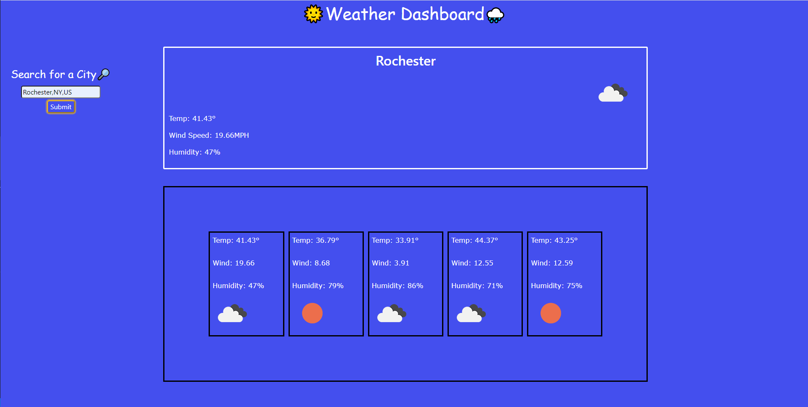

# Challenge-06
OpenWeatherAPI Challenge Assignment

## Description

This application is designed to allow users to submit City / State / Country inputs and receive current day + 5-day weather forecasting.

## Future Development

This project has reached its MVP, but still needs some upgraded functionality to 1) allow for local storage to hold recent weather searches and 2) to fix a bug that requires search inputs to have no spaces. Example, you must search "Rochester,NY,US" rather than "Rochester, NY, US" in order for the application to serve any weather data.

## View My Work Here ↓

https://jaqsentanner.github.io/Challenge-06/

## Application Screenshot ↓

## License

This project is unlicensed and intended to be used in a learning environment only. 
